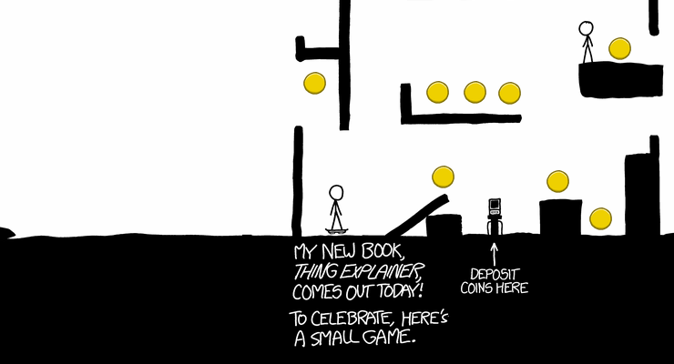

# hoverboard-sdl

[](https://travis-ci.org/AMDmi3/hoverboard-sdl)
[](https://ci.appveyor.com/project/AMDmi3/hoverboard-sdl)


Standalone version of [xkcd 1608 "Hoverboard"](https://xkcd.com/1608/) game.



## Why

I'm a big fan of [xkcd](https://xkcd.com/) by Randall Munroe, and
now he has released an exploration game to celebrate [his new
book](https://xkcd.com/thing-explainer/). The game is great as all
his comics, however it unfortunately is only available on web, which
implies:

* You can't play offline
* It's a pain to play with poor or intermittent connection
* Inefficient web technologies waste your battery life and may produce noticeable lags
* You are limited with fixed 740x700 visible area, which may take only a small part of available screen space, or, vice versa, not fit into the screen
* You can't see the source
* You can't improve it, for example implementing save/load or a minimap

So there's plenty of reasons to have a proper native application,
and, given that Randall makes the art available under [CC-by-NC
license](https://xkcd.com/license.html), I want to accomplish that.

## Features

I consider this a feature-complete reimplementation - it provides
the complete experience of the original hame and only lacks some
hidden features like Gandalf mode. The project is now focused on
optimization and extra features (such as game state saving).

Extra features compared to original:

* **Persistent state** - when you leave the game, you location and
  picked coins are saved, so when you run the game again, you may
  continue your journey from the same point
* **Saved locations** - you may save up to 10 locations and return
  to them with a single key press
* **Map** - shows explored parts of the world and known coin locations

## Controls

* **Arrow keys** or **WASD** or **HJKL** - move character
* **Esc** or **Q** - leave the game
* **Ctrl+0**, **Ctrl+1** ... **Ctrl+9** - save player location
* **0**, **1** ... **9** - jump to corresponding saved location
* **Tab** - toggle map

## Building

Dependencies:

* [CMake](http://www.cmake.org/)
* [SDL2](http://libsdl.org/)
* [SDL2_image](https://www.libsdl.org/projects/SDL_image/)
* [SDL2_ttf](https://www.libsdl.org/projects/SDL_ttf/)

To install these on apt-using system sych as Debian or Ubuntu, run:

```
apt-get install cmake libsdl2-dev libsdl2-image-dev libsdl2-ttf-dev
```

The project also uses libSDL2pp, C++11 bindings library for SDL2.
It's included into git repository as a submodule, so if you've
obtained source through git, don't forget to run ```git submodule
init && git submodule update```.

To build and run the game without installation:

```
cmake .
make
./hoverboard
```

To install systemwide:

```
cmake -DCMAKE_INSTALL_PREFIX=/usr/local -DSYSTEMWIDE=ON
make
make install
```

To create self-contained directory for standalone package:

```
cmake -DCMAKE_INSTALL_PREFIX=./package -DSTANDALONE=ON
make
make install
```

## Author

* [AMDmi3](https://github.com/AMDmi3) <amdmi3@amdmi3.ru>

## License

* Code: GPLv3 or later, see COPYING
* Assets by Randall Munroe, Creative Commons Attribution-NonCommercial 2.5 License, see [xkcd.com](https://xkcd.com/license.html).

The project also bundles third party software under its own licenses:

* extlibs/libSDL2pp (C++11 SDL2 wrapper library) - zlib license
